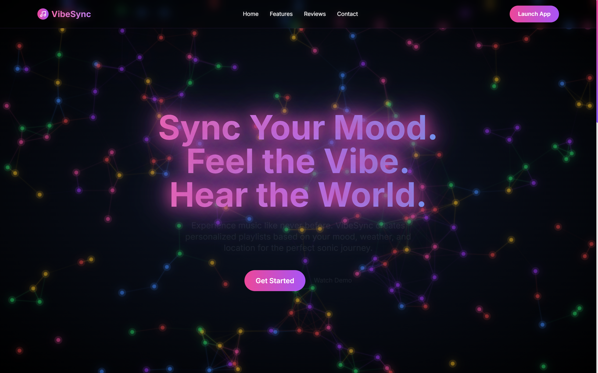
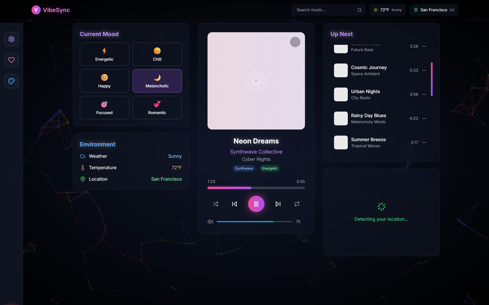

# VibeSync
# 🎵 Context-Aware Music Recommendation System

## Overview

Live Demo: [https://vibe-sync-5um1.vercel.app/](https://vibe-sync-5um1.vercel.app/)

VibeSync is a next-generation music recommendation platform that curates personalized playlists based on your **location**, **mood**, and **real-time weather**. It creatively adapts its visual and audio experience using data from public APIs and offers a seamless, interactive user journey.

---

## 🌟 Key Features

### 🌍 Location-Based Recommendations
- Suggests music that matches your current city or travel destination
- Highlights trending tracks and local artists using geolocation

### 🎭 Mood-Based Curation
- Lets users select or adjust their mood
- Dynamically adapts playlists to emotional context and mood transitions

### 🌤️ Weather-Responsive Music & Visuals
- Fetches live weather data via the **OpenWeather API**
- Creatively adjusts the website's visual theme in real time based on weather (colors, gradients, effects)
- Matches musical genres and tempos to current weather and season

### 🌀 Custom Creative Loading States
- Features a unique, animated loading screen that keeps users engaged while waiting for API responses (location, weather, Spotify)
- Step-by-step progress indicators for a delightful onboarding and data-fetching experience

### 🗣️ Text-to-Speech (TTS) Integration
- Uses the **Web Speech API** to read out page content
- Accessible TTS button for hands-free listening to app features and descriptions

### 🎧 Spotify API Integration
- Suggests songs and playlists using the **Spotify API**
- Real-time music search and recommendations based on user context

---




---

## 🛠️ Installation & Setup

```bash
# Clone the repository
git clone https://github.com/zacker-zxz/VibeSync.git
cd VibeSync

# Install dependencies
npm install

# Set up environment variables
cp .env.example .env
# Add your API keys for OpenWeather, Spotify, and any other services

# Start development server
npm run dev
```

---

## 📄 License

This project is licensed under the MIT License.

## 📞 Support & Contact

- Issues: Please report bugs via GitHub Issues
- Email: tejastayade4@gmail.com, aryan201107@gmail.com

*Creating the perfect soundtrack for every moment, wherever you